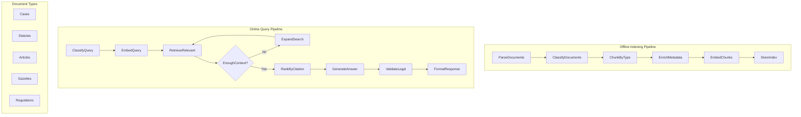

# Marriage Law RAG System Design

## 1. Requirements

**Problem**: Legal professionals and citizens need quick, accurate access to marriage-related legal information scattered across cases, laws, legal articles, gazettes, and other records.

**Solution**: A RAG system that can intelligently retrieve relevant legal documents and provide contextual answers to marriage law queries.

**User Stories**:
- Lawyer: "What are the legal requirements for marriage in jurisdiction X?"
- Citizen: "Can I marry my second cousin under current law?"
- Judge: "What precedents exist for divorce settlements involving international assets?"

## 2. Flow Design

### High-Level Architecture



### Document Type Classifications
- **Cases**: Court decisions, precedents, case law
- **Statutes**: Primary legislation, marriage acts
- **Articles**: Legal commentary, academic papers
- **Gazettes**: Official announcements, new regulations
- **Regulations**: Administrative rules, procedures

## 3. Utilities Design

### Core Utilities (`utils/` directory)

1. **`enhanced_pdf_extractor.py`**
   - Input: PDF/DOC files from local filesystem
   - Output: Extracted text with multiple fallback strategies
   - Purpose: Robust text extraction using PyPDF2, pdfplumber, and pymupdf with OCR fallback

2. **`document_classifier.py`**
   - Input: Parsed document text
   - Output: Document type classification + confidence
   - Purpose: Categorize documents for specialized processing

3. **`legal_chunker.py`**
   - Input: Classified document + metadata
   - Output: Semantically meaningful chunks
   - Purpose: Split documents at logical boundaries (sections, paragraphs, citations)

4. **`legal_metadata_extractor.py`**
   - Input: PDF document and extracted text
   - Output: Legal metadata (case numbers, dates, jurisdictions, court info)
   - Purpose: Extract structured legal information from document properties and content

5. **`ocr_processor.py`**
   - Input: Scanned PDF pages or image files
   - Output: OCR-extracted text with confidence scores
   - Purpose: Handle scanned legal documents that can't be parsed with standard text extraction

6. **`embedding_service.py`**
   - Input: Text chunks
   - Output: Vector embeddings
   - Purpose: Convert text to searchable vectors

7. **`postgres_vector_store.py`**
   - Input: Embeddings + metadata
   - Output: PostgreSQL with pgvector operations
   - Purpose: Store and search document vectors with ACID compliance

8. **`legal_retriever.py`**
   - Input: Query embedding + filters
   - Output: Ranked relevant chunks
   - Purpose: Retrieve documents with legal-specific ranking

9. **`citation_validator.py`**
   - Input: Legal text
   - Output: Validated citations + links
   - Purpose: Verify and format legal citations

10. **`document_validator.py`**
   - Input: Extracted document text and metadata
   - Output: Quality score and validation report
   - Purpose: Ensure document completeness and extraction quality

11. **`llm_caller.py`**
   - Input: Prompt + context
   - Output: LLM response
   - Purpose: Call legal-trained LLM with proper formatting

## 4. Data Design

### PostgreSQL Database Schema

```sql
-- Enable pgvector extension
CREATE EXTENSION IF NOT EXISTS vector;

-- Main legal documents table
CREATE TABLE legal_documents (
    id SERIAL PRIMARY KEY,
    file_path TEXT NOT NULL,
    doc_type VARCHAR(50) NOT NULL, -- case, statute, article, gazette, regulation
    jurisdiction VARCHAR(100) NOT NULL,
    title TEXT,
    authority VARCHAR(200), -- court, legislature, agency
    date_issued DATE,
    authority_level INTEGER CHECK (authority_level >= 1 AND authority_level <= 10),
    raw_text TEXT,
    metadata JSONB,
    created_at TIMESTAMP DEFAULT CURRENT_TIMESTAMP,
    updated_at TIMESTAMP DEFAULT CURRENT_TIMESTAMP
);

-- Document chunks with vectors
CREATE TABLE document_chunks (
    id SERIAL PRIMARY KEY,
    document_id INTEGER REFERENCES legal_documents(id) ON DELETE CASCADE,
    chunk_index INTEGER NOT NULL,
    text TEXT NOT NULL,
    section_title VARCHAR(500),
    page_number INTEGER,
    paragraph_number INTEGER,
    embedding vector(1536), -- Assuming OpenAI ada-002 embeddings (1536 dims)
    citations TEXT[], -- Array of citations found in chunk
    legal_concepts TEXT[], -- Extracted legal concepts
    chunk_metadata JSONB,
    created_at TIMESTAMP DEFAULT CURRENT_TIMESTAMP
);

-- Indexes for efficient querying
CREATE INDEX idx_chunks_embedding ON document_chunks 
USING ivfflat (embedding vector_cosine_ops) WITH (lists = 100);

CREATE INDEX idx_chunks_doc_type ON document_chunks 
USING btree ((chunk_metadata->>'doc_type'));

CREATE INDEX idx_chunks_jurisdiction ON document_chunks 
USING btree ((chunk_metadata->>'jurisdiction'));

CREATE INDEX idx_chunks_authority_level ON document_chunks 
USING btree (((chunk_metadata->>'authority_level')::integer));

CREATE INDEX idx_chunks_date ON document_chunks 
USING btree ((chunk_metadata->>'date_issued'));

-- Legal citations tracking
CREATE TABLE legal_citations (
    id SERIAL PRIMARY KEY,
    citation_text VARCHAR(500) UNIQUE NOT NULL,
    normalized_citation VARCHAR(500),
    citation_type VARCHAR(50), -- case, statute, regulation, etc.
    jurisdiction VARCHAR(100),
    year INTEGER,
    authority_level INTEGER,
    is_primary BOOLEAN DEFAULT false -- primary vs secondary authority
);

-- Many-to-many relationship between chunks and citations
CREATE TABLE chunk_citations (
    chunk_id INTEGER REFERENCES document_chunks(id) ON DELETE CASCADE,
    citation_id INTEGER REFERENCES legal_citations(id) ON DELETE CASCADE,
    PRIMARY KEY (chunk_id, citation_id)
);

-- Query logs for analytics and improvement
CREATE TABLE query_logs (
    id SERIAL PRIMARY KEY,
    user_query TEXT NOT NULL,
    query_type VARCHAR(50),
    jurisdiction_filters TEXT[],
    retrieved_chunk_ids INTEGER[],
    generated_answer TEXT,
    confidence_score DECIMAL(3,2),
    user_feedback INTEGER CHECK (user_feedback >= 1 AND user_feedback <= 5),
    response_time_ms INTEGER,
    created_at TIMESTAMP DEFAULT CURRENT_TIMESTAMP
);
```

### Shared Store Schema

```python
shared = {
    # Document processing
    "raw_documents": [
        {
            "path": "/docs/case1.pdf",
            "type": "case",
            "jurisdiction": "federal",
            "date": "2023-01-15",
            "authority": "Supreme Court"
        }
    ],
    
    # Processed chunks
    "document_chunks": [
        {
            "id": "chunk_001",
            "text": "Marriage is legally defined as...",
            "doc_type": "statute",
            "jurisdiction": "california", 
            "section": "Family Code 300",
            "embedding": [...],  # vector representation
            "citations": ["Family Code 301", "Case Smith v. Jones"],
            "authority_level": 9  # 1-10 scale
        }
    ],
    
    # Search infrastructure  
    "db_connection": postgres_connection_object,
    "vector_table": "legal_documents_vectors",
    
    # Query processing
    "user_query": "What are grounds for divorce?",
    "query_type": "procedural",  # legal, procedural, definitional
    "query_embedding": [...],
    "jurisdiction_filter": ["california", "federal"],
    
    # Results
    "retrieved_chunks": [...],
    "ranked_results": [...],
    "generated_answer": "Based on California Family Code...",
    "citations": ["Family Code 2310", "Case Doe v. Roe (2020)"],
    "confidence_score": 0.85
}
```

## 5. Node Design

### Offline Indexing Nodes

1. **ParseDocumentsNode** (BatchNode)
   - Type: Batch processing for multiple documents
   - Prep: Read file paths from shared["raw_documents"]
   - Exec: Use legal_parser.py to extract text + basic metadata
   - Post: Store parsed documents in shared["parsed_documents"]

2. **ClassifyDocumentsNode** (BatchNode)
   - Type: Batch processing
   - Prep: Read parsed documents
   - Exec: Use document_classifier.py to determine document types
   - Post: Update documents with classification in shared["classified_documents"]

3. **ChunkByTypeNode** (BatchNode)
   - Type: Batch processing with type-specific chunking
   - Prep: Read classified documents
   - Exec: Use legal_chunker.py with type-specific strategies
   - Post: Store chunks in shared["document_chunks"]

4. **EnrichMetadataNode** (BatchNode)
   - Type: Batch processing for metadata enhancement
   - Prep: Read document chunks
   - Exec: Use metadata_enricher.py to add legal context
   - Post: Update chunks with enriched metadata

5. **EmbedChunksNode** (AsyncParallelBatchNode)
   - Type: Parallel async for faster embedding
   - Prep: Read enriched chunks
   - Exec: Use embedding_service.py to generate vectors
   - Post: Store embeddings in chunks

6. **StoreIndexNode** (Node)
   - Type: Regular node for database storage
   - Prep: Read all embedded chunks
   - Exec: Use postgres_vector_store.py to insert into pgvector table
   - Post: Store connection info in shared["db_connection"]

### Online Query Nodes

7. **ClassifyQueryNode** (Node)
   - Type: Regular node
   - Prep: Read user query from shared["user_query"]
   - Exec: Classify query intent and legal domain
   - Post: Store query metadata, return action for specialized flow

8. **EmbedQueryNode** (Node)
   - Type: Regular node
   - Prep: Read classified query
   - Exec: Use embedding_service.py to embed query
   - Post: Store query embedding

9. **RetrieveRelevantNode** (Node)
   - Type: Regular node with retry for search expansion
   - Prep: Read query embedding + filters
   - Exec: Use legal_retriever.py for similarity search
   - Post: Store results, return "sufficient" or "expand" action

10. **ExpandSearchNode** (Node)
   - Type: Fallback node for broader search
   - Prep: Read previous search parameters
   - Exec: Broaden search criteria (more docs, lower threshold)
   - Post: Store expanded results

11. **RankByCitationNode** (Node)
   - Type: Regular node for legal-specific ranking
   - Prep: Read retrieved chunks
   - Exec: Re-rank by citation authority, recency, jurisdiction
   - Post: Store ranked results in shared["ranked_results"]

12. **GenerateAnswerNode** (Node)
   - Type: Regular node with retry for answer quality
   - Prep: Read query + ranked context chunks
   - Exec: Use llm_caller.py with legal prompt template
   - Post: Store answer, return "valid" or "retry" action

13. **ValidateLegalNode** (Node)
   - Type: Regular node for answer validation
   - Prep: Read generated answer
   - Exec: Use citation_validator.py to check legal accuracy
   - Post: Store validation results

14. **FormatResponseNode** (Node)
   - Type: Final formatting node
   - Prep: Read answer + validation + citations
   - Exec: Format with proper legal citations and disclaimers
   - Post: Store final response in shared["formatted_response"]

## 6. Implementation Files Structure

```
marriage-law-rag/
├── main.py                    # Entry point
├── flows.py                   # Offline and Online flows
├── nodes.py                   # All node definitions
├── utils/
│   ├── __init__.py
│   ├── enhanced_pdf_extractor.py    # Multi-strategy PDF text extraction
│   ├── ocr_processor.py             # OCR for scanned documents
│   ├── document_classifier.py       # ML-based doc classification
│   ├── legal_metadata_extractor.py  # Extract legal metadata from PDFs
│   ├── document_validator.py        # Validate document quality
│   ├── legal_chunker.py            # Smart legal text chunking
│   ├── embedding_service.py        # Text to vector conversion
│   ├── postgres_vector_store.py    # PostgreSQL + pgvector operations
│   ├── legal_retriever.py          # Legal-aware search with SQL
│   ├── citation_validator.py       # Legal citation checking
│   └── llm_caller.py               # LLM API wrapper
├── requirements.txt           # Dependencies including psycopg2, pgvector
├── database/
│   ├── schema.sql             # PostgreSQL schema creation
│   ├── migrations/            # Database migration scripts
│   └── seed_data.sql          # Sample data for testing
├── config/
│   ├── jurisdictions.yaml     # Supported jurisdictions
│   ├── document_types.yaml    # Document classification
│   └── legal_prompts.yaml     # LLM prompt templates
├── data/
│   ├── raw/                   # Raw legal documents
│   ├── processed/             # Processed chunks
│   └── indexes/               # Vector indexes
└── docs/
    └── design.md              # This design document
```

## 7. Usage Example

```python
# Offline indexing (run once or periodically)
offline_shared = {
    "raw_documents": [
        {"path": "data/raw/marriage_act_2023.pdf", "jurisdiction": "federal"},
        {"path": "data/raw/smith_vs_jones.pdf", "jurisdiction": "california"},
        # ... more documents
    ]
}

offline_flow.run(offline_shared)

# Online query processing
online_shared = {
    "user_query": "What are the legal requirements for same-sex marriage?",
    "jurisdiction_filter": ["federal", "california"],
    "db_connection": offline_shared["db_connection"],
    "vector_table": "legal_documents_vectors"
}

online_flow.run(online_shared)
print(f"Answer: {online_shared['formatted_response']}")
```

This design provides a robust, legally-aware RAG system that can handle the complexity of marriage law documents while providing accurate, well-cited responses to user queries.